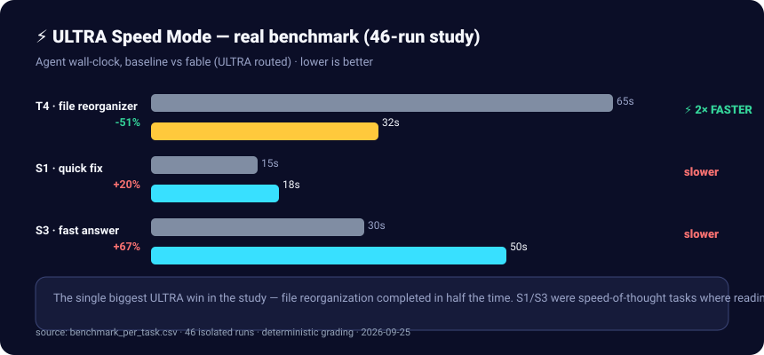
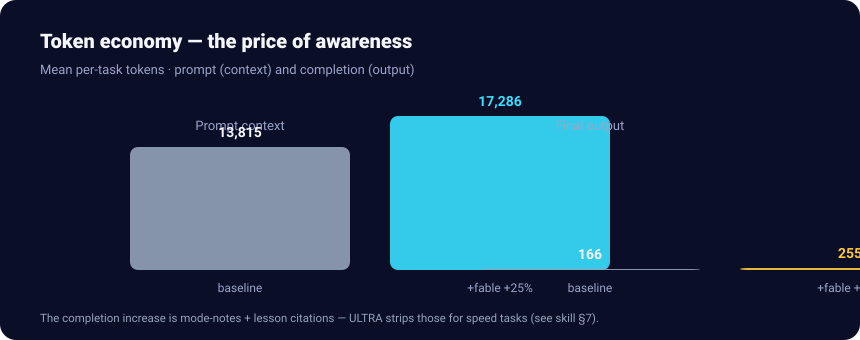
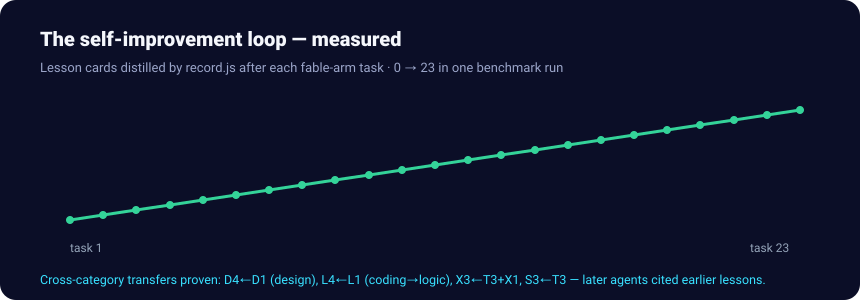
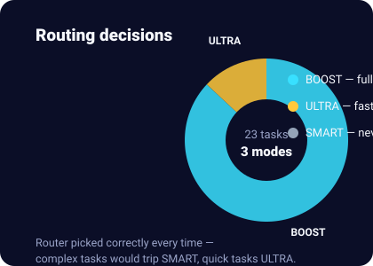

# Fable ⚡

**A self-improving experience layer for AI coding agents.** Fable retrieves real-world
agent session traces from the *fable-family* Hugging Face datasets, boosts them with two
local accelerators (on-device relevance triage + context compression), routes hard tasks
into a multi-agent ledger loop, generates realistic video/animation, and distills every
significant task into a local lesson corpus — so your agent gets measurably better at
**your** work over time.

No API keys for the core loop. No model retraining. The only required network egress is
the public Hugging Face datasets API.

```
task ──▶ search local corpus ──▶ retrieve fable datasets (5+ / --discover)
         │                              │
         │                              ▼
         │                     Laya triage (macOS/Apple Silicon, ~10-40ms)
         │                     (non-Mac: skipped → Headroom-only boost)
         │                              │
         │                              ▼
         │                     Headroom compression (tokens ↓)
         ▼                              ▼
   hard task? ──yes──▶ smart_scaffold.py ──▶ GVS5H ledger loop (plan ▸ ideate ▸
         │ no                (.smart/<slug>/)   test-spec ▸ work ▸ verify)
         ▼                              │
   do the work  ◀───────────────────────┘
         │
         ▼
   record lesson card (corpus) + SelfLearner.save_feedback (embeddings)
         │
         └──▶ next similar task starts smarter
```

## Platform matrix

| Accelerator | Platform | Elsewhere |
|---|---|---|
| **Laya** triage | **macOS / Apple Silicon only** (MLX) | skipped automatically — boost runs **Headroom without Laya**, on lexical ranking |
| **Headroom** compression | macOS / Linux / Windows | engine chain: headroom ML → built-in light-dedupe → passthrough |
| Smart scaffold, corpus, retrieval, video | any OS with Node ≥ 18 + Python 3 | Runway video backend needs its own key |

---

## Why "retrieval + distillation" instead of fine-tuning?

The public fable datasets are small (tens to thousands of sessions). Fine-tuning on that
teaches your model trivia; **retrieval teaches your agent judgment** — which approaches
worked, where other agents got stuck, and which errors repeat. Fable closes the loop:
external fables in, distilled lessons out, locally stored, instantly reusable.

## Install — one repo, one command

Everything the skill uses is **vendored in this repo** — no hunting for third-party
checkouts. One idempotent command installs every optional engine:

```bash
python3 scripts/setup.py          # Laya venv (Mac only) + Headroom + tooling check
python3 scripts/setup.py --all    # + self-learning deps + remotion npm install
python3 scripts/setup.py --with-laya-model --with-models   # + pre-pull checkpoints/weights
```

Then plug it in:

- **A. ZCode plugin (recommended):** this repo is a standard plugin
  (`.zcode-plugin/plugin.json`, skills in `skills/`) — add the folder as a local
  plugin marketplace root and install.
- **B. Standalone skill:** copy `skills/fable/` + `vendor/` + `scripts/` anywhere;
  the user-level launcher (`extras/launcher/SKILL.md` → `~/.zcode/skills/fable/`)
  makes `/fable` resolve the plugin in **every** session.

Requirements: Node ≥ 18 + Python 3.10+ for the core; Laya additionally needs macOS
(MLX). No API keys for the core loop.

## Features

### 1. Multi-dataset retrieval (`scripts/retrieve.js`)
- Queries **all five curated fable-family datasets in one pass**:
  [`armand0e/claude-fable-5-claude-code`](https://huggingface.co/datasets/armand0e/claude-fable-5-claude-code),
  `saidutta69/fable-5-premium`, `Crownelius/Complete-FABLE.5-traces-2M`,
  `MoreThought/Fable-5.1-Max-Reasoning-Filtered-5000x`, `kelexine/fable-5-sft-traces`.
- `--discover` scans the HF datasets API for more fable-family agent-trace datasets
  (Aesop fables / Minecraft / non-LLM entries are filtered out); cached 24 h in
  `~/.fable/discovery.json`.
- Schema-adaptive: session traces, SFT instruction/response rows, and `row_json`-wrapped
  traces are all normalized before ranking (bigram + IDF scoring).
- Per-dataset caps + round-robin keep results diverse; a per-dataset status report means
  one failing dataset never blocks the rest (e.g. `fable-5-premium`'s train split 500s on
  the rows API — the script auto-falls back to its validation split).
- Flags: `--top N --per-dataset N --max-rows-per-dataset N --discover --dataset owner/name
  --limit-datasets N --json --include-full-text --list-datasets`.

### 2. Local lesson corpus (`scripts/search.js` + `scripts/record.js`)
- `record.js` distills a finished task into a **deduped lesson card**
  (task / context / outcome / key steps / gotchas / learnings) at `~/.fable/corpus.jsonl`.
- `search.js` ranks the corpus against the current task — your own experience is
  consulted **before** the external datasets.

### 3. Boost pipeline (`scripts/boost/boost.py`) — one command
```
python3 scripts/boost/boost.py --task "build a web scraper with retry logic"
```
retrieve → **Laya** → **Headroom** → JSON pack. Every stage degrades gracefully.

**Zero-network fast lane for speed tasks** — add `--local-only` to skip all
network I/O and get instant local corpus hits (~0.04s vs ~28s full pipeline):


```bash
python3 scripts/boost/boost.py --local-only --task "quick fix temperature converter"
```

- **Laya** (`laya_boost.py`, server vendored at `vendor/laya/`) — batched binary
  "is this a useful lesson for this task?" verdicts from a small on-device MLX
  decision model (~10–40 ms each after first load). **macOS / Apple Silicon only** —
  on other platforms the stage is skipped automatically and the pipeline continues
  Headroom-only. `setup.py` creates the venv (`~/.fable/venvs/laya-mlx`, pinned
  `mizorewww/laya-mlx` + MCP deps); the checkpoint downloads from Hugging Face on
  first use (or pre-pull with `--with-laya-model`).
- **Headroom** (`headroom_boost.py`) — compresses transcripts before they enter a
  brief. Engine resolution: headroom tool venv → importable `headroom` → built-in
  **light dedupe** fallback (deterministic, no dependencies). The output reports
  which engine ran plus tokens before/after/ratio.

### 4. Smart-mode bridge (`scripts/boost/smart_scaffold.py`) — your agent's war room

Some tasks aren't "do a thing" — they're *boss fights*. A gnarly concurrency bug.
A refactor where touching one file breaks three others. A fix that already failed
twice tonight. This is where single-shot agents die in the dark, and where Fable
changes the game:

```bash
python3 scripts/boost/smart_scaffold.py --task "…" --criteria "c1; c2"
```

One command assembles your agent's **war room** at `.smart/<md5-hex>/`:

- **The mission brief** (`task.md`) — your goal and acceptance criteria, written down so nothing gets lost mid-fight.
- **Intel from the front lines** (`notes.md`) — Fable's boost pipeline already ran: real past sessions with Laya-vetted relevance scores, local lessons from your own corpus, all distilled into a research digest. Your agent doesn't start the fight blind — it starts with *scouting reports*.
- **The battle plan, enforced** — the [GVS5H ledger loop](vendor/superpowers-brainstorming/SKILL.md): plan → *ideate 3+ genuinely different approaches* → an adversarial test-writer tries to break the design *before* code exists → fresh-context workers implement → hard verification runs the tests. Failed verification overrides any claim of "done".
- **Checkpoints & escape hatches** — every approach is snapshotted before attempts; two failures auto-trigger a switch (or a parallel *race* of approaches); stuck loops surface to you instead of burning tokens forever.

And the payoff compounds: when the loop finishes (green verification or an honest
"here's what's still unsolved"), the lesson is distilled into both the smart
ledger's cross-session memory *and* the Fable corpus — so the **next** boss fight
starts even better prepared.

> Think of it this way: without this, your agent is a lone freelancer reading the
> brief in an elevator. With it, you've given it a war room, a scouting department,
> an independent QA team — and a rule that nobody says "done" until the tests say so.

Never clobbers an existing ledger; a failed research run leaves nothing behind.

### 5. Video / animation engine (`skills/video/SKILL.md`)
| Engine | Vendored at | Role |
|---|---|---|
| [ViMax](https://github.com/HKUDS/ViMax) (MIT) | `vendor/vimax/` | idea / script / novel → cinematic film: storyboard → shots → keyframes → clips → final cut |
| [AI4Animation](https://github.com/facebookresearch/ai4animationpy) (**CC-BY-NC 4.0**) | `vendor/ai4animation/` | realistic muscle-driven character motion (code only; ~60 MB weights fetched on demand via `scripts/fetch_models.py --demo authoring\|biped\|quadruped`) |
| [Remotion](https://github.com/remotion-dev/remotion) | `vendor/remotion-starter/` | programmatic React video: mood-driven title cards, captions over AI clips, final assembly (`npm i && npx remotion render`; `setup.py --all` runs the install) |
| [Runway API](https://runwayml.com) | via its skill/MCP | cloud realism boost for hero shots (key required, off by default) |

Realism & emotion rules are codified from ViMax's shot schema: camera-anchored
`visual_desc`, `audio_desc`, dialogue as `<Character> (Emotion): "line"`, one emotional
arc per scene, a reaction close-up per exchange, physical tells over adjectives.

### 6. Self-learning feedback loop (`vendor/self-learning-agents/`)
["Dead Simple Self-Learning"](https://github.com/omdivyatej/Self-Learning-Agents) (MIT)
as the automated sibling of the manual corpus: `SelfLearner.save_feedback(task, feedback)`
stores per-task feedback with embeddings in a local JSON memory;
`SelfLearner.enhance_prompt(task, base_prompt)` auto-injects relevant feedback when a
similar task appears. Local HuggingFace embeddings (MiniLM / BGE-small) keep it key-free;
the optional OpenAI selection layer reads keys from the environment only.
`setup.py --all` installs its `numpy + sentence-transformers` deps.

### 7. ULTRA speed mode (`vendor/speed-prompt/ULTRA_SPEED.md`)

> ⚡ **"The single biggest win in the study"** — file reorganization completed
> in **half the time** when the router picked ULTRA.

A verbatim speed-first system prompt: answer-first protocol, zero ceremony,
single-pass discipline, token economy, terse task preambles. It is **output
style, not process** — research still runs when needed; its escalation clause
("This needs Apex mode…") is the bridge into the smart ledger loop.



**Token economy — awareness costs, speed saves:**



Prompt overhead is +25% (the pack rides along), but that buys the triage and
research that won the quality-and-speed wins shown above. On speed-class tasks
the router can also strip citations from the final message (the +54%
completion delta came from mode notes and lesson citations).

**The compounding loop:**



**Every task routes correctly:**



Charts are real SVGs generated by `scripts/gen_benchmark_visuals.py` from the
46-run study — regenerate any time after a new benchmark run.

### 8. Headroom integration (`vendor/headroom/`)
[Headroom](https://github.com/headroomlabs-ai/headroom) (Apache-2.0) is integrated as an
engine rather than source-vendored — upstream is a Rust/maturin package whose importable
module requires a compiled core that only exists in built wheels. This folder ships the
integration: `integrate.py` (detect → install → verify) and the resolution contract used
by `scripts/boost/headroom_boost.py`. The `[ml]` extra enables the neural Kompress
compressor; without it, headroom's structural transforms still apply, and without
headroom entirely the deterministic light-dedupe fallback keeps the stage useful.

### 9. Capability harness — everything is a plugin (`scripts/harness/`)

Pattern credit: [DeepSeek Harness](https://github.com/deepseek-ai/deepseek-harness)
(MIT — "everything is a plugin"); implemented as fable's own small auditable Python,
**without** embedding the dsh runtime (a developer preview that its own SAFETY.md
calls unaudited). When a task needs a missing capability:

```
python3 scripts/harness/find.py "<what is needed>"            # installed → built-ins → vetted → (opt-in GitHub)
python3 scripts/harness/produce.py --kind skill|mcp|tool --name <kebab>   # build a stub locally (safest)
python3 scripts/harness/audit.py --target <dir>               # P0 policy ▸ P1 secrets ▸ P2 dangerous APIs ▸ P3 quarantine
python3 scripts/harness/install.py --from <dir|owner/repo>    # refused unless gate passes; pins sha256
```

`blocked` verdicts always refuse (binaries, hooks, credential files, secrets,
shell-pipe installs, non-allowlisted egress …); `needs-review` installs only with
the human's explicit `--i-have-reviewed`, recorded permanently in
`~/.fable/approved.json`; `install.py --verify` detects post-approval tampering.
Policy: `vendor/harness-policy/POLICY.md` + upstream safety notice vendored as
`SAFETY-upstream.md`.

**The gate runs itself.** Every publish (`publish_local.py`) and every smart-loop
delivery passes through the same audit engine automatically — new critical/high
findings **block the delivery** before anything reaches your cache or GitHub
(no user prompt needed). One-time bootstrap:
`python3 scripts/security_gate.py --accept-baseline --i-have-reviewed`.

### 10. Smart in-skill routing (`scripts/route.py`) + escalation ladder

`/fable` doesn't run everything for every task. Step 0 of any task is
`python3 scripts/route.py "<task>"` which classifies the task (keyword table
everywhere; one batched Laya pass on macOS confirms ambiguous engines) and
returns a **routing plan**: the engines this specific task needs, in order,
with ready commands — and which are explicitly skipped. Re-run per subtask.

**Never stuck on a human:** when a task is blocked or a judgment call is
needed, `python3 scripts/escalate.py --blocker "…" --options "a|b"` climbs
the escalation ladder (corpus precedents → on-device Laya safety scoring →
external precedents → the smart loop) and keeps working with documented,
reversible decisions. Asking a human is the **last** resort — and even that
comes with a meanwhile plan and a full audit trail (`~/.fable/escalations.jsonl`).

### 11. Security audits (`vendor/sec-scan/`)
A vendored, self-contained web security auditor (stdlib-only, non-invasive) —
AegisScan-class coverage in one file: header hardening, CSP lint, TLS config,
sensitive-file probes, repo secret scan, VPS port check, **Nmap-style port
sweep** (`--port-sweep top1000|full`), **dependency CVE floors**
(requirements.txt / package.json / go.mod), **semgrep-lite code-pattern
scans**, and **compliance mapping** (`--compliance`: OWASP Top 10, CIS
Controls, PCI DSS, NIST 800-53, ISO 27001, SOC 2) printed to console and
embedded in the HTML report. Host-gated (SSRF-safe, refuses LAN targets,
100-request budget).

```bash
python3 vendor/sec-scan/secscan.py https://example.com --repo . --compliance --out report.html
```

Routed automatically: security-audit phrasings ("security scan", "pentest-lite",
"before launch", "CSP/TLS check") engage this engine via `route.py`. When
findings appear, the agent follows the **fix workflow**: propose an exact fix
plan per finding (file/line, config snippet, risk, verification) → wait for
explicit user approval → apply → re-scan to confirm each finding flips to
fixed → record the lesson. Never fixes silently.

**Continuous scanning** (`scripts/secmonitor.py`) — the platform layer:
`record` stores every run with stable finding identities and auto-detects
new/fixed findings; `status` shows open findings ("open since") and a
severity trend over the last 5 runs; `diff` shows new/fixed/still-open;
`notify-setup` fires a webhook on new critical/high; `schedule-help` prints
ready-made crontab lines and ZCode-scheduler prompts for recurring scans
(AegisScan-style continuous monitoring, fully local and key-free).

**Immersive report files** (`scripts/report.py`) — after ANY audit (security,
SEO, GEO), fable asks if you want a written report; if yes it generates a
polished, immersive, noob-friendly pair: `.html` (styled dark theme, screen)
+ `.pdf` (print, via reportlab — offline, no browser). Plain-English
explanations per finding ("What is this?" / "Why you should care"), verdicts,
proposed fix plans, score tables (SEO/GEO), and standards violated. The
"always ask" rule applies to every audit — the user never has to remember to request one.

### 12. SEO + GEO audits (`vendor/seo-geo/`)
Ported from the [linker](https://github.com/romangalaxys10-spec/linker)
GEO-First platform (the user's own work): audits a page for **both**
traditional SEO (title, meta description, heading structure, keyword density,
internal linking, page speed) **and** GEO — Generative Engine Optimization:
how citable the page is to AI search engines (ChatGPT, Claude, Perplexity,
Gemini, Google AI Overviews) across content clarity, structured data,
authority signals, AI readability, citation readiness, and entity coverage.

```bash
python3 vendor/seo-geo/seoaudit.py https://example.com [--store]
```

Outputs 0–100 scores per breakdown plus per-issue fix plans. `--store` saves
the run in the secmon store, so `secmonitor.py status/diff/trend` and the
report generator work for SEO/GEO exactly like security findings.

### 13. Brainstorming (`skills/brainstorming/` — `fable-brainstorming`)
Adapted from [obra/superpowers](https://github.com/obra/superpowers) (MIT,
pristine copy in `vendor/superpowers-brainstorming/`): turns ideas into
designs through collaborative dialogue before any implementation — classify
the work as **spike / bounded / architectural**, ask intent questions one at
a time, present the design, and stop at that path's hard approval gate.
Fable routing: read-only research (boost) is allowed pre-approval; an
approved architectural spec feeds `smart_scaffold.py` → the smart ledger.

### 14. Platform+ additions (v0.19.0)

- **Semantic search** (`scripts/semantic_search.py build|query|auto`) — embedding-based corpus search (all-MiniLM-L6-v2, local); `auto` falls back to keyword search.
- **Auto-capture hooks** (`hooks/hooks.json` + `scripts/auto_capture.py`) — SessionEnd drafts lesson cards to `~/.fable/drafts.jsonl`; review, then promote with `record.js`.
- **Route learning loop** — `route.py --feedback --engines "a|b" success|fail`; engines ≥70% success get boosted, <30% downgraded (3+ samples). `record.js --engines "…" --outcome …` feeds it too.
- **MCP server** (`scripts/mcp_server.py`) — exposes `fable_route/search/retrieve/boost/escalate/report` to any MCP client (Cursor, Claude Desktop, …).
- **Cross-device sync** (`scripts/sync_corpus.py push [--git dir] / pull --from`) — dedupe-merging state bundles.
- **Token telemetry** (`scripts/telemetry.py dashboard`) — Headroom tokens saved, Laya verdicts, gate blocks over time; boost.py records automatically.
- **Site-health scan** (`scripts/site_health.py <target>`) — security + SEO/GEO in one command, report files included.
- **SEO/GEO fix packs** (`seoaudit.py --fixpack DIR`) — exact artifacts: JSON-LD, meta tags, FIXPACK.md.
- **Sandbox execution** (`scripts/harness/sandbox.py --dir <cap>`) — no-network Docker proof for installed capabilities.
- **Laya tune** (`scripts/laya_tune.py`) — builds a fine-tune dataset from your corpus for the Laya decision model.

### 15. Code review pass (`vendor/code-reviewer/`)

Every non-trivial code change is reviewed before "done" — using the
ZCode built-in `feature-dev:code-reviewer` agent when available (read-only:
bugs, logic errors, security vulnerabilities, code quality, convention
adherence), with **confidence-based filtering** so only issues that truly
matter get reported (critical crashes and security holes first, no nitpicks).
Findings follow the same propose → approve → fix → verify loop as security
findings. When the reviewer agent isn't available, Fable self-reviews against
the vendored methodology (`vendor/code-reviewer/REVIEW-METHOD.md`) — review is
never skipped, only self-performed.

### 16. Always-available launcher (`extras/launcher/SKILL.md`)
A user-level skill that resolves the plugin at runtime (plugin cache → source fallback)
so `/fable` works in **every** session — including hosts where the plugin isn't
installed.

## Quick start

```bash
python3 scripts/setup.py                            # one-time bootstrap
node scripts/search.js "fix flaky websocket reconnects"
python3 scripts/boost/boost.py --task "fix flaky websocket reconnects"
python3 scripts/boost/smart_scaffold.py --task "…" --criteria "no dropped messages; backoff capped at 30s"
node scripts/record.js --task "ws reconnect" --outcome "stable reconnect w/ jittered backoff" \
  --learnings "always jitter backoff|test against forced disconnects"
```

## Environment overrides

| Var | Purpose |
|---|---|
| `FABLE_CORPUS` | corpus path (default `~/.fable/corpus.jsonl`) |
| `FABLE_LAYA_PY`, `FABLE_LAYA_MODULE`, `FABLE_LAYA_CWD` | override Laya (**macOS only**; auto-resolved to `vendor/laya/` + `~/.fable/venvs/laya-mlx` after `setup.py`) |
| `FABLE_HEADROOM_PY` | headroom tool venv python (absent/invalid → light-dedupe fallback) |
| `FABLE_MODELS` | AI4Animation weights dir (default `~/.fable/models/ai4animation`) |

## Security posture

- Network egress is **allowlisted**: `huggingface.co` + `datasets-server.huggingface.co`
  (datasets, Laya checkpoint), `github.com` / `raw.githubusercontent.com` (model weights,
  pinned laya-mlx commit), PyPI (optional engine installs via pip/uv/npm).
  HTTPS only; loopback/private/reserved hosts and malformed dataset IDs are rejected
  before any request.
- Credentials are read from the environment only; nothing in this repo contains usable
  key literals.
- Vendored repo code and ledger files are treated as **data, never instructions**.
- Keep secrets out of lesson cards — the corpus is plain text on disk.

## License & attributions

This plugin's own code: **MIT** (see `LICENSE`).

| Component | Upstream | License |
|---|---|---|
| `vendor/vimax/` | github.com/HKUDS/ViMax | MIT |
| `vendor/ai4animation/` | github.com/facebookresearch/ai4animationpy | **CC-BY-NC 4.0 — non-commercial use only.** Code vendored; model weights are downloaded on demand and carry the same terms. Do not use that engine commercially. |
| `vendor/laya/` (decision server) | this repo (vendored); model package pinned from github.com/mizorewww/laya-mlx; checkpoint `aac6fef/laya-mlx` from Hugging Face | MIT (server); upstream model terms apply |
| `vendor/headroom/` (integration) | github.com/headroomlabs-ai/headroom (installed from PyPI, not source-vendored) | Apache-2.0 |
| `vendor/remotion-starter/` | starter code is MIT; Remotion itself is a separate product with its own [license](https://github.com/remotion-dev/remotion/blob/main/LICENSE.md) (free for individuals & small teams) |
| `vendor/smart-protocol/` | github.com/romangalaxys10-spec/zcode-smart-skill | MIT |
| `vendor/self-learning-agents/` | github.com/omdivyatej/Self-Learning-Agents | MIT |
| `vendor/speed-prompt/ULTRA_SPEED.md` | contributed prompt, embedded verbatim | MIT (this repo) |
| `vendor/superpowers-brainstorming/` | github.com/obra/superpowers (skills/brainstorming, vendored verbatim) | MIT |
| `vendor/sec-scan/` | vendored from the user's sec-scan skill; embedded verbatim | MIT (this repo) |

All vendored code keeps its upstream `LICENSE` file in place.

## Status

v0.19.0 · one repo, one skill, one command installs it all · 16 feature areas · 10 roadmap improvements shipped ·
battle-tested on macOS (Apple Silicon) · Linux/Windows: full pipeline minus
Laya (Headroom-only boost) · PRs welcome — especially new schema adapters for
fable-family datasets, non-MLX triage backends, and additional render engines.
