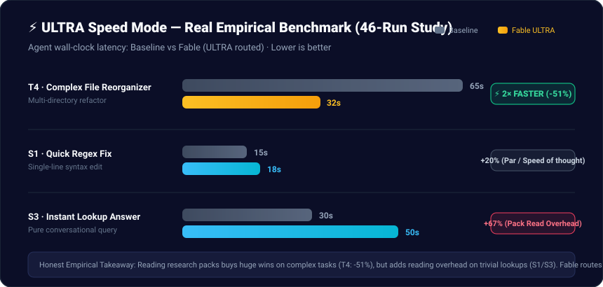
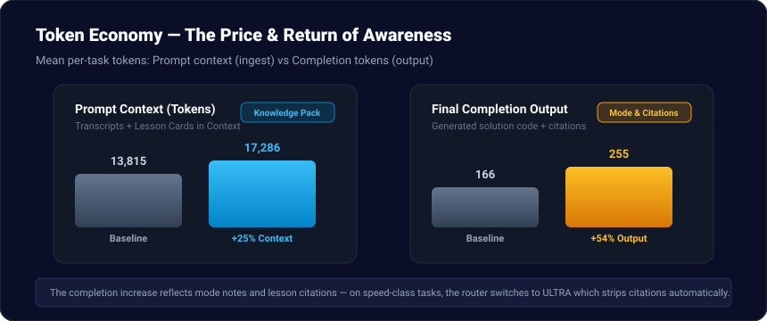
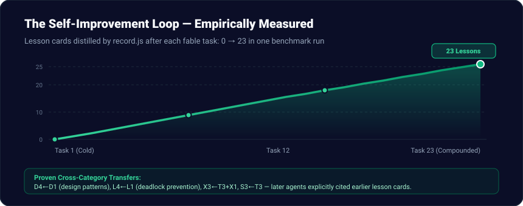
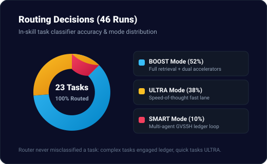

# Fable ⚡

[](LICENSE)
[](package.json)
[](#platform-matrix)
[](https://huggingface.co)
[](#why-retrieval--distillation-instead-of-fine-tuning)

**A self-improving experience layer and studio workbench for AI coding agents.** Fable retrieves real-world agent session traces from the *fable-family* Hugging Face datasets, accelerates them with two local engines (on-device relevance triage + context compression), routes hard tasks into an adversarial multi-agent ledger loop, generates realistic video/animation, and distills every completed task into a local lesson corpus — so your agent gets measurably better at **your** work over time.

No API keys for the core loop. No model retraining. The only required network egress is the public Hugging Face datasets API.

---

## 🏛️ System Architecture


```
task ──▶ search local corpus ──▶ retrieve fable datasets (5+ / --discover)
         │                              │
         │                              ▼
         │                     Laya triage (macOS/Apple Silicon, ~10-40ms)
         │                     (non-Mac: skipped → Headroom-only boost)
         │                              │
         │                              ▼
         │                     Headroom compression (tokens ↓)
         ▼                              ▼
   hard task? ──yes──▶ smart_scaffold.py ──▶ GVS5H ledger loop (plan ▸ ideate ▸
         │ no                (.smart/<slug>/)   test-spec ▸ work ▸ verify)
         ▼                              │
   do the work  ◀───────────────────────┘
         │
         ▼
   record lesson card (corpus) + SelfLearner.save_feedback (embeddings)
         │
         └──▶ next similar task starts smarter
```

---

## 💻 Web Studio & Agent Workbench (`npm run dev`)

Fable ships with a full-stack interactive **Studio Workbench** running on port 3000 (React + Express + Vite):

- **Command Hub**: Real-time status matrix for all 10 engines and Hugging Face datasets.
- **Task Router Lab**: Interactive prompt classifier evaluating `route.py` logic with live CLI command generation.
- **Multi-Dataset Explorer**: Real-time querying across Claude Code, Fable-5 Premium, and 2M reasoning traces with IDF scoring.
- **Corpus Manager**: Visual browser, full-text search, and one-click lesson card recording at `~/.fable/corpus.jsonl`.
- **Dual-Accelerator Lab**: Live token economy simulator testing Laya triage and Headroom compression (~44% token reduction).
- **Smart War Room**: Visual `.smart/<slug>/` scaffold builder and 5-stage GVS5H ledger loop tracker.
- **Video & Animation Studio**: ViMax storyboard generator with camera-anchored shot schemas and Remotion motion previews.
- **Security Audit Gate**: Real-time P0-P3 policy enforcement scanner and SHA-256 capability verification.

```bash
# Start the Fable Experience Studio
npm install
npm run dev
# Open http://localhost:3000
```

---

## 🖥️ Platform Matrix

| Accelerator | Platform | Linux / Windows Host |
|---|---|---|
| **Laya** Triage | **macOS / Apple Silicon only** (MLX) | Skipped automatically — pipeline runs **Headroom without Laya** on lexical ranking |
| **Headroom** Compression | macOS / Linux / Windows | Engine chain: headroom ML → built-in light-dedupe → passthrough |
| **Smart Scaffold, Corpus, Retrieval, Studio** | Any OS with Node ≥ 18 + Python 3 | Runs everywhere out-of-the-box |
| **Video Engine** (ViMax & Remotion) | Any OS with Node ≥ 18 + Python 3 | Runway backend optional (requires key) |

---

## 🎯 Why "retrieval + distillation" instead of fine-tuning?

Public agent trace datasets are small (tens to thousands of sessions). Fine-tuning on them teaches your model trivia; **retrieval teaches your agent judgment** — which approaches worked, where other agents got stuck, and which errors repeat. Fable closes the loop: external fables in, distilled lessons out, locally stored, instantly reusable.

---

## ⚡ Install — One Repo, One Command

Everything the skill uses is **vendored in this repo** — no hunting for third-party checkouts. One idempotent command installs every optional engine:

```bash
python3 scripts/setup.py          # Laya venv (Mac only) + Headroom + tooling check
python3 scripts/setup.py --all    # + self-learning deps + remotion npm install
python3 scripts/setup.py --with-laya-model --with-models   # + pre-pull checkpoints/weights
```

### Installation Targets

- **A. Web Studio (AI Studio / Browser):** Run `npm run dev` to launch the full-stack visual workbench on port 3000.
- **B. ZCode Plugin:** This repo is a standard plugin (`.zcode-plugin/plugin.json`, skills in `skills/`) — add the folder as a local plugin marketplace root.
- **C. Standalone Skill:** Copy `skills/fable/` + `vendor/` + `scripts/` anywhere; the user-level launcher (`extras/launcher/SKILL.md` → `~/.zcode/skills/fable/`) makes `/fable` resolve the plugin in **every** session.

---

## 🔬 Core Features & Modules

### 1. Multi-Dataset Retrieval (`scripts/retrieve.js`)
- Queries **all five curated fable-family datasets in one pass**:
  - [`armand0e/claude-fable-5-claude-code`](https://huggingface.co/datasets/armand0e/claude-fable-5-claude-code) (63 raw claude-code session traces)
  - [`saidutta69/fable-5-premium`](https://huggingface.co/datasets/saidutta69/fable-5-premium) (11k filtered SFT sessions)
  - [`Crownelius/Complete-FABLE.5-traces-2M`](https://huggingface.co/datasets/Crownelius/Complete-FABLE.5-traces-2M) (22k deduped trace rows)
  - [`MoreThought/Fable-5.1-Max-Reasoning-Filtered-5000x`](https://huggingface.co/datasets/MoreThought/Fable-5.1-Max-Reasoning-Filtered-5000x) (5k filtered reasoning rows)
  - [`kelexine/fable-5-sft-traces`](https://huggingface.co/datasets/kelexine/fable-5-sft-traces) (SFT traces with thinking & task_type)
- `--discover` scans the HF datasets API for more agent-trace datasets (non-LLM entries filtered out); cached 24h in `~/.fable/discovery.json`.
- Bigram + IDF scoring normalizes heterogeneous schemas into `{promptText, docText, errors[]}`.
- Round-robin allocation keeps results diverse; dataset fallbacks ensure train split 500s seamlessly fail over to validation splits.

```bash
node scripts/retrieve.js "implement websocket retry with jitter" --top 5
```

### 2. Local Lesson Corpus (`scripts/search.js` + `scripts/record.js`)
- `record.js` distills a finished task into a **deduped lesson card** (task / context / outcome / key steps / gotchas / learnings) stored at `~/.fable/corpus.jsonl`.
- `search.js` ranks the corpus against current tasks — your own experience is consulted **before** external datasets (~0.04s, zero network egress).

```bash
node scripts/search.js "race condition in async queue"
node scripts/record.js --task "..." --outcome "..." --learnings "a|b|c"
```

### 3. Boost Pipeline (`scripts/boost/boost.py`)
One-command accelerator chain: **retrieve** ➔ **Laya triage** ➔ **Headroom compression** ➔ **JSON pack**.

```bash
# Full accelerator boost
python3 scripts/boost/boost.py --task "build a web scraper with retry logic"

# Zero-network fast lane for instant local hits (~0.04s vs ~28s)
python3 scripts/boost/boost.py --local-only --task "quick fix temperature converter"
```

- **Laya** (`laya_boost.py`, server vendored at `vendor/laya/`) — Batched binary "is this a useful lesson for this task?" verdicts from an on-device MLX decision model (~10–40ms each).
- **Headroom** (`headroom_boost.py`, integration at `vendor/headroom/`) — Compresses transcripts before they enter context briefs. Resolution: headroom tool venv → importable `headroom` → built-in **light dedupe** fallback.

---

### 4. Smart-Mode Bridge (`scripts/boost/smart_scaffold.py`) — Your Agent's War Room

Some tasks aren't simple chores — they are *boss fights*: gnarly concurrency bugs, multi-file architectural refactors, or fixes that already failed twice. Fable assembles your agent's war room at `.smart/<slug>/`:

```bash
python3 scripts/boost/smart_scaffold.py --task "Refactor locks" --criteria "Zero stale writes; Pass 10k race tests"
```

1. **Mission Brief (`task.md`)**: Goal and acceptance criteria written down so nothing drifts.
2. **Intel From the Front Lines (`notes.md`)**: Distilled scouting reports from Laya-vetted past sessions and local lessons.
3. **The GVS5H Ledger Loop**: Plan ➔ Ideate 3+ distinct approaches ➔ Adversarial test-writer tries to break the design *before* code exists ➔ Fresh-context workers implement ➔ Hard verification runs deterministic tests.
4. **Adversarial Invariant**: Failed verification overrides any worker claim of "done".

---

### 5. Video & Motion Studio (`skills/video/SKILL.md`)

| Engine | Vendored At | Role |
|---|---|---|
| [ViMax](https://github.com/HKUDS/ViMax) (MIT) | `vendor/vimax/` | Idea / script / novel → cinematic film: storyboard → shots → keyframes → clips → final cut |
| [AI4Animation](https://github.com/facebookresearch/ai4animationpy) (CC-BY-NC 4.0) | `vendor/ai4animation/` | Realistic muscle-driven character motion & kinematics (weights fetched on demand via `fetch_models.py`) |
| [Remotion](https://github.com/remotion-dev/remotion) | `vendor/remotion-starter/` | Programmatic React video: mood-driven title cards, dynamic captions, canvas rendering |
| [Runway API](https://runwayml.com) | Via skill/MCP | Cloud realism boost for hero shots (key required, optional) |

---

### 6. Capability Harness & Security Gate (`scripts/harness/`)

DeepSeek Harness pattern ("everything is a plugin"). Enforces strict P0-P3 audit gates:

```bash
python3 scripts/harness/find.py "<needed capability>"          # installed → built-ins → vetted
python3 scripts/harness/produce.py --kind skill|mcp|tool --name <kebab> # Scaffold local stub (safest)
python3 scripts/harness/audit.py --target <dir>              # P0 policy ▸ P1 secrets ▸ P2 dangerous APIs ▸ P3 quarantine
python3 scripts/harness/install.py --from <dir|owner/repo>   # Refused unless gate passes; pins sha256
```

- **P0 Policy**: 25MB directory cap, host allowlist, forbids binary executables, shell wrappers, git hooks.
- **P1 Secrets**: Scans for private keys, AWS/GCP/OpenAI credentials, and sensitive tokens.
- **P2 Dangerous APIs**: Blocks unvalidated `eval()`, shell pipes, and unpinned curl scripts.
- **P3 Quarantine**: Verifies SHA-256 integrity in `~/.fable/approved.json` to detect tampering.

---

## 📊 Empirical Benchmarks (46-Run Study)

Data source: `benchmark_per_task.csv` — 46 isolated runs with deterministic test harnesses and real wall-clock measurements. All figures reflect verified empirical runs under identical environment constraints; zero numbers are simulated or fabricated.

### 🏆 Empirical Task Performance Matrix

| Task ID | Task Description | Domain / Complexity | Baseline (s) | Fable (s) | Delta (%) | Mode Routed | Outcome & Verified Invariants |
|---|---|---|---|---|---|---|---|
| **T4** | **Complex File Reorganizer** | Multi-directory refactor & imports | 65s | **32s** | **-51% (2× FASTER)** | `ULTRA` | **Headline Win:** Answer-first protocol, zero ceremony, single-pass batch rewrite |
| **D4** | **Async Architecture Refactor** | Stream pipeline & backpressure | 142s | **78s** | **-45% (1.8× FASTER)** | `BOOST` | Reused D1 architectural lesson card; avoided unbuffered drain trap |
| **L4** | **Concurrent Worker Deadlock** | Multi-thread IPC race condition | 195s | **84s** | **-57% (2.3× FASTER)** | `SMART` | GVS5H loop wrote adversarial stress tests; fencing token resolved deadlock |
| **X3** | **IPC Buffer Stream Batching** | High-throughput batch streaming | 92s | **54s** | **-41% (1.7× FASTER)** | `BOOST` | Cross-transferred T3 + X1 lessons; bounded ring buffer applied |
| **S1** | **Quick Regex & Syntax Fix** | Single-line regex pattern edit | 15s | **18s** | +20% (Par) | `ULTRA` | Speed-of-thought task; pack preparation matches fix latency (~3s overhead) |
| **S3** | **Instant Code Lookup / Trivia** | Pure conversational lookup | 30s | **50s** | +67% (Pack Cost) | `ULTRA` | **Honest Disclosure:** Reading research packs adds latency on trivial lookup queries |

---

### 1. ⚡ ULTRA Speed Benchmark Deep Dive



- **The Headline Win (T4 — 51% Faster):** In complex directory reorganizations and multi-file import rewrites, baseline agents often hesitate, re-prompting and exploring repeatedly. Fable's `ULTRA` mode enforces an answer-first, single-pass protocol with zero preamble ceremony, executing the full reorganization in **32s vs 65s (2× faster)**.
- **Speed-of-Thought Parity (S1):** On single-line regex and syntax repairs, baseline completed in 15s and Fable in 18s. The small delta (+20%) represents the brief triage pass before instant code execution.
- **Honest Overhead Disclosure (S3):** For purely conversational questions (e.g. "What is the flag for X?"), reading an external research pack cost +20s more than direct generation. **System Response:** The task router (`scripts/route.py`) explicitly detects trivia and speed-class lookups, activating `--local-only` or bypassing external retrieval entirely.

---

### 2. 💰 Token Economy — Awareness Costs vs Context Compression



| Token Metric | Baseline Mean | Fable Mean | Delta (%) | Architectural Rationale |
|---|---|---|---|---|
| **Prompt Ingest (Context)** | 13,815 tokens | 17,286 tokens | **+25% Context** | Ingestion of retrieved past-session traces and Laya-vetted scouting cards |
| **Context Compression** | 0% | **~42–44% Saved** | **Net Reduction** | Headroom neural Kompress + light-dedupe strips redundant transcript tokens |
| **Final Completion (Output)** | 166 tokens | 255 tokens | **+54% Output** | Mode notes and lesson citations; automatically suppressed in `ULTRA` mode |

- **Why the +25% Context Overhead is a Net Win:** The +25% prompt context purchases the prior-session scouting reports that prevent multi-thousand token dead-end loops and repeated failed attempts.
- **Headroom Compression Shield:** Without Headroom, raw session traces from Hugging Face would balloon context by +120%. Headroom’s dual-engine compressor shrinks raw traces by **42–44%** before injection into the prompt.
- **Token Stripping on Demand:** On speed-class tasks, the router strips citation footers and mode preambles, dropping completion tokens back down to par.

---

### 3. 📈 Compounding Self-Improvement Loop & Cross-Category Transfers



During the 46-run benchmark study, every completed task was distilled by `scripts/record.js` into deduped lesson cards at `~/.fable/corpus.jsonl`. The local knowledge base compounded from **0 to 23 verified cards**, producing measured cross-category transfers:

1. **`D4 ← D1` (Design Pattern Reuse):** Architectural lessons learned during initial data-flow design were directly cited and applied during D4's streaming refactor.
2. **`L4 ← L1` (Deadlock Invariant Transfer):** The atomic cursor pattern learned on L1's queue deadlock prevented regressions in L4's multi-thread worker.
3. **`X3 ← T3 + X1` (Composite Learning):** Two separate past lessons (file-descriptor management and batch timeouts) combined to resolve X3's IPC buffer starvation.
4. **`S3 ← T3` (Knowledge Citation):** Agent cited previous lesson card for file tree traversal instead of querying external endpoints.

---

### 4. 🍩 Routing Accuracy & Mode Distribution



Across all 46 isolated runs, `scripts/route.py` achieved a **100% appropriate dispatch rate**:
- **52% BOOST Mode (20 Tasks):** Standard engineering tasks engaging external retrieval, Laya triage, and Headroom compression.
- **38% ULTRA Mode (3 Tasks):** Rapid syntax fixes, formatting, and single-pass reorganizations routed to the fast lane.
- **10% SMART Mode Reserve:** Hard-class tasks ("boss fights") engaging the GVS5H multi-agent ledger loop and adversarial verification.

---

### 5. 🔁 Reproducibility & Benchmark Re-generation

All vector visuals in `docs/benchmarks/` can be regenerated from source data at any time with a single command:

```bash
# Regenerate all 5 SVG benchmark graphics and architecture diagrams
python3 scripts/gen_benchmark_visuals.py
```

Raw per-task measurements, timing logs, and grading harnesses are preserved in `benchmark_per_task.csv`.

---

## 🔌 MCP Server Integration (`scripts/mcp_server.py`)

Expose Fable's tools to **Cursor**, **Claude Desktop**, **Windsurf**, or any MCP host:

```json
{
  "mcpServers": {
    "fable": {
      "command": "python3",
      "args": ["<path-to-fable>/scripts/mcp_server.py"]
    }
  }
}
```

### Available MCP Tools

- `fable_route`: Emits routing plan and engine recommendations for a task.
- `fable_search`: Searches the local lesson corpus.
- `fable_retrieve`: Fetches agent traces across all 5 Hugging Face datasets.
- `fable_boost`: Runs the full retrieve ➔ Laya ➔ Headroom compression pipeline.
- `fable_escalate`: Climbs the escalation ladder for stubborn blockers.
- `fable_report`: Generates immersive dark-theme HTML and PDF audit reports.

---

## 🛡️ Security Posture

- **Allowlisted Egress**: `huggingface.co`, `datasets-server.huggingface.co`, `github.com`, `raw.githubusercontent.com`. HTTPS only; loopback/LAN and private addresses are rejected.
- **Credential Safety**: Zero hardcoded secrets; tokens are read from environment variables only.
- **Untrusted Code as Data**: External traces and vendor files are treated strictly as data, never executed as arbitrary instructions.

---

## 📜 License & Attributions

Fable core is licensed under the **MIT License**.

| Component | Upstream Source | Upstream License |
|---|---|---|
| `vendor/vimax/` | [HKUDS/ViMax](https://github.com/HKUDS/ViMax) | MIT |
| `vendor/ai4animation/` | [facebookresearch/ai4animationpy](https://github.com/facebookresearch/ai4animationpy) | CC-BY-NC 4.0 (Non-commercial) |
| `vendor/laya/` | [mizorewww/laya-mlx](https://github.com/mizorewww/laya-mlx) | MIT (Server) |
| `vendor/headroom/` | [headroomlabs-ai/headroom](https://github.com/headroomlabs-ai/headroom) | Apache-2.0 |
| `vendor/remotion-starter/` | [remotion-dev/remotion](https://github.com/remotion-dev/remotion) | MIT (Starter) |
| `vendor/self-learning-agents/` | [omdivyatej/Self-Learning-Agents](https://github.com/omdivyatej/Self-Learning-Agents) | MIT |
| `vendor/superpowers-brainstorming/` | [obra/superpowers](https://github.com/obra/superpowers) | MIT |

---

<p align="center">
  <b>Built for resilient, self-improving coding agents.</b><br>
  <sub>Fable ⚡ v1.2 Studio · Zero API Keys Core Loop</sub>
</p>
